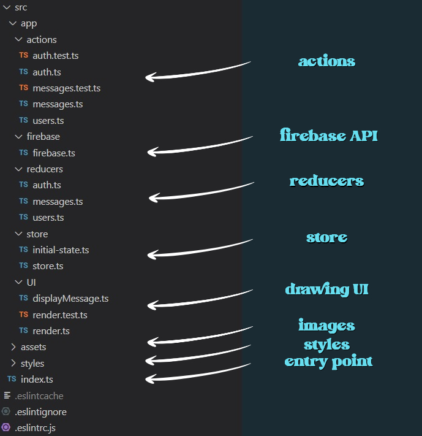

<h1 align="center">Чат</h1>

_**[Развёрнуто здесь](https://djess-v.github.io/otus--homework--17/)**_

---

<h2>Визуальное представление</h2>

<h2>Описание приложения</h2>

1. С помощью данного приложения можно обмениваться сообщением в онлайн режиме.

2. Прежде чем отправлять сообщение - пройдите авторизацию.

<h2>Структура проекта</h2>

